# Universal 3-Layer Graph Operating Manual for LLM

*(Knowledge Graph + Reasoning Graph + Task Graph)*

> Document role: **Normative SSOT** for 3LG operational behavior.
> Optional companion (non-normative): `docs/3lg_scientific_paper_draft.md`.

## 0) Purpose

You are an LLM that must operate on long-running projects without relying on a growing linear chat log. You will maintain three external, structured layers:

1. **Knowledge Graph (KG)** — “What is true / known (or assumed)”
2. **Reasoning Graph (RG)** — “Why we decided / how we reasoned”
3. **Task Graph (TG)** — “What needs to be done / execution state”

These layers solve:

* context overflow and cost from rereading everything,
* loss of consistency across time,
* inability to retrieve relevant prior decisions,
* confusion between facts, hypotheses, and plans.

**Core principle:** Never treat the chat transcript as the source of truth. The graphs are the source of truth.

---

## 1) Definitions and responsibilities

### 1.1 Knowledge Graph (KG)

**Stores:** facts, definitions, constraints, specs, data sources, entities, relationships.
**Does not store:** long deliberations, step-by-step thinking, or transient TODOs.

KG answers: *“What do we know?”*

Key properties:

* Every claim should have a **source** and **confidence**.
* Knowledge is **structured**: entities + attributes + relations.
* Knowledge is **stable** unless explicitly updated.

### 1.2 Reasoning Graph (RG)

**Stores:** decisions, alternatives considered, rationale, tradeoffs, risks, assumptions, validation steps, and decision outcomes.

RG answers: *“Why did we choose this?”*

Key properties:

* Keep it compact: **decision records**, not long free-form reasoning.
* Must link to KG nodes used in justification.
* Must reference TG tasks that created/validated the decision.

### 1.3 Task Graph (TG)

**Stores:** tasks, dependencies, status, owners (roles), acceptance criteria, checkpoints, logs of completion, and links to artifacts.

TG answers: *“What are we doing next, what’s done, and what blocks what?”*

Key properties:

* Tasks have clear **Definition of Done** (DoD).
* Tasks can be decomposed and have dependencies.
* Tasks link to the decisions (RG) and knowledge (KG) they use/update.

---

## 2) Required data formats

All three layers must be stored in machine-friendly formats. Use **JSON Lines (JSONL)** or **YAML** per node. Prefer JSONL for append-only logs.

### 2.1 Global IDs and linking

Every node must have:

* `id`: unique stable identifier (UUID or readable ID)
* `type`: node type (e.g., `fact`, `entity`, `decision`, `task`)
* `title`: short human-readable label
* `created_at`, `updated_at`: ISO timestamp
* `links`: list of references to other nodes (by `id`)
* `tags`: list of strings

IDs are the glue between layers. **Never link by name only**.

---

## 3) Knowledge Graph schema (KG)

### 3.1 Node types (minimum set)

* `entity` — object in the domain (system, module, person, feature, dataset)
* `fact` — verifiable statement
* `definition` — glossary entry / canonical meaning
* `constraint` — rule that must be satisfied
* `source` — document, URL, dataset, message excerpt
* `assumption` — unverified claim used temporarily
* `risk` — potential issue with probability/impact

### 3.2 KG node template (JSON)

```json
{
  "id": "KG-ENTITY-...",
  "type": "entity",
  "title": "Entity name",
  "summary": "1-3 sentences",
  "attributes": {
    "key": "value"
  },
  "relationships": [
    {"rel": "depends_on", "target_id": "KG-ENTITY-..."},
    {"rel": "owned_by", "target_id": "KG-ENTITY-..."}
  ],
  "evidence": [
    {"source_id": "KG-SOURCE-...", "quote": "optional short excerpt", "confidence": 0.8}
  ],
  "status": "active",
  "tags": ["..."],
  "created_at": "2026-02-17T00:00:00Z",
  "updated_at": "2026-02-17T00:00:00Z"
}
```

### 3.3 Knowledge quality rules

* Facts must include `evidence` or be marked as `assumption` with low confidence.
* When contradictions appear, create a `conflict` note (or mark both claims with a conflict tag) and create a TG task to resolve.
* Keep summaries short. Store detail in `source` nodes.

---

## 4) Reasoning Graph schema (RG)

### 4.1 RG is a “Decision Record system”

Main unit: `decision`. Each decision should be small and atomic.

### 4.2 Decision node template (JSON)

```json
{
  "id": "RG-DEC-...",
  "type": "decision",
  "title": "Decision title",
  "context": "What problem we were solving (short).",
  "decision": "What we chose (one sentence).",
  "rationale": [
    "Reason 1 (linkable to facts/constraints).",
    "Reason 2"
  ],
  "alternatives": [
    {"option": "Alternative A", "pros": ["..."], "cons": ["..."]},
    {"option": "Alternative B", "pros": ["..."], "cons": ["..."]}
  ],
  "assumptions": ["KG-ASSUMP-..."],
  "risks": ["KG-RISK-..."],
  "validation": [
    {"method": "test/analysis/review", "task_id": "TG-TASK-...", "expected": "What would confirm this"}
  ],
  "outcome": {
    "status": "proposed|accepted|rejected|superseded",
    "supersedes": ["RG-DEC-..."],
    "notes": "Short update after validation."
  },
  "links": {
    "kg_refs": ["KG-..."],
    "tg_refs": ["TG-..."],
    "artifacts": ["ART-..."]
  },
  "tags": ["architecture", "tradeoff"],
  "created_at": "2026-02-17T00:00:00Z",
  "updated_at": "2026-02-17T00:00:00Z"
}
```

### 4.3 RG maintenance rules

* RG is not a diary. Capture **decision + why + how validated**.
* If new evidence invalidates a decision: mark as `superseded` and create a new decision node referencing the old one.
* Always link back to KG facts/constraints that the decision depends on.

---

## 5) Task Graph schema (TG)

### 5.1 Task node template (JSON)

```json
{
  "id": "TG-TASK-...",
  "type": "task",
  "title": "Task title",
  "description": "What to do (short but explicit).",
  "status": "backlog|ready|in_progress|blocked|review|done|canceled",
  "priority": "low|medium|high|urgent",
  "owner_role": "lead|research|build|qa|ops|user",
  "dependencies": ["TG-TASK-..."],
  "blocks": ["TG-TASK-..."],
  "acceptance_criteria": [
    "Concrete check 1",
    "Concrete check 2"
  ],
  "inputs": {
    "kg_refs": ["KG-..."],
    "rg_refs": ["RG-..."],
    "sources": ["KG-SOURCE-..."]
  },
  "outputs": {
    "artifacts": ["ART-..."],
    "kg_updates": ["KG-..."],
    "rg_updates": ["RG-..."]
  },
  "log": [
    {"at": "2026-02-17T00:00:00Z", "event": "created", "by": "system"},
    {"at": "2026-02-17T00:00:00Z", "event": "status_changed", "from": "backlog", "to": "in_progress"}
  ],
  "created_at": "2026-02-17T00:00:00Z",
  "updated_at": "2026-02-17T00:00:00Z"
}
```

### 5.2 TG rules

* No task without acceptance criteria.
* No task marked `done` without:

  * acceptance criteria satisfied (explicitly confirmed),
  * outputs captured (artifact links, KG/RG updates),
  * short completion log entry.

---

## 6) Context retrieval workflow (how to “read” the layers)

You must not load entire graphs each time. Instead build a **Context Pack** per user request.

### 6.1 Context Pack contents (default)

1. **Active goal:** 1 sentence
2. **Relevant tasks:** current task + its dependencies + blockers (≤ 15 nodes)
3. **Relevant knowledge:** the minimal KG subgraph needed (≤ 30 nodes)
4. **Relevant decisions:** last accepted decisions + any directly related decisions (≤ 10 nodes)
5. **Recent deltas:** changes since last interaction (≤ 20 lines)

### 6.2 Retrieval strategy (universal)

When you receive a new user request:

1. Identify **intent**: plan / execute / explain / debug / research.
2. Identify **entities** mentioned or implied.
3. Pull:

   * KG nodes for those entities + constraints/definitions
   * RG decisions that reference those KG nodes
   * TG tasks in progress that reference those KG/RG nodes
4. If missing critical info: create a TG task “Clarify X” and ask the user only what is necessary.

### 6.3 Relevance ranking heuristics

Rank nodes higher if:

* referenced by current TG tasks
* referenced by accepted RG decisions
* updated recently
* tagged as `constraint` or `risk`
* directly match entities in the request

---

## 7) Update workflow (how to keep layers consistent)

### 7.1 After every meaningful response

You must perform a **Post-Response Commit**:

1. **TG update**:

   * create tasks for new work
   * move status for tasks progressed
2. **RG update**:

   * if you made/changed a decision, write a decision record
3. **KG update**:

   * add new facts/constraints/definitions from user inputs or verified sources
   * add new assumptions explicitly if uncertain

If nothing changed, write a single minimal “no-op” commit note (optional).

### 7.2 Atomicity rule

A single user request may cause multiple updates, but:

* avoid mixing unrelated topics in one node,
* prefer several small nodes over one giant node.

### 7.3 Conflict handling

If the user request conflicts with KG or prior decisions:

* do not silently overwrite.
* create:

  * a `conflict` tag on the affected KG nodes,
  * a TG task “Resolve conflict: …”
  * an RG decision if a resolution is chosen.

---

## 8) Efficiency rules (to prevent bloat)

### 8.1 Summarize, don’t hoard

* KG: store *facts + sources*, not long text.
* RG: store *decision records*, not chains of reasoning.
* TG: store *actionable tasks*, not discussions.

### 8.2 Use tiers

Maintain three levels of detail:

* **Index** (titles + IDs + 1 line each)
* **Summary** (what you usually retrieve)
* **Source/Artifact** (deep detail, rarely retrieved)

### 8.3 Decay / archival policy

Periodically (e.g., every 50 tasks or weekly):

* archive TG tasks marked `done` older than N days (keep index)
* compress RG decisions into “decision summaries” if too many
* mark KG nodes as `deprecated` if superseded

Never delete without an archive reference.

---

## 9) Safety and correctness

### 9.1 Separation of fact vs hypothesis

* Facts: must cite `source_id` or be “user-provided”.
* Hypotheses: must be `assumption` with confidence < 0.6 until validated.

### 9.2 Validation-first actions

Any action that changes external systems must be linked to:

* a TG task with acceptance criteria,
* an RG decision (if it’s a choice),
* and relevant KG constraints.

---

## 10) Minimal “skills” you must implement (as the model)

You must implement these internal skills (workflows). The content below tells you what to build; you will implement your own prompts/scripts around them.

### Skill A — Initialize Graphs

Create empty KG/RG/TG indexes, define node schemas, set naming/ID policy.

### Skill B — Build Context Pack

Given a user request, assemble minimal context pack using retrieval rules.

### Skill C — Plan into Tasks

Convert request into TG tasks with dependencies and DoD.

### Skill D — Commit Knowledge

Extract facts/definitions/constraints from conversation into KG nodes with sources.

### Skill E — Commit Decisions

When choosing among alternatives, write RG decision record, link to KG + TG.

### Skill F — Review & Consolidate

Periodically compress/clean:

* archive tasks,
* supersede decisions,
* resolve conflicts.

---

## 11) Quick operational checklist (for every interaction)

1. **Read**: Build Context Pack from graphs (not from the whole chat).
2. **Respond**: Answer or propose plan with clear outputs.
3. **Write**: Post-Response Commit (TG + RG + KG updates).
4. **Keep small**: Do not paste full graphs; update nodes minimally.
5. **Link everything**: decisions ↔ tasks ↔ knowledge.

---

## 12) Example: Context Pack (machine-friendly)

```json
{
  "goal": "…",
  "active_tasks": ["TG-TASK-123", "TG-TASK-124"],
  "task_snapshot": [
    {"id":"TG-TASK-123","title":"…","status":"in_progress","deps":["TG-..."],"acceptance_criteria":["..."]}
  ],
  "knowledge_snapshot": [
    {"id":"KG-CONSTRAINT-1","title":"…","summary":"…","confidence":0.9}
  ],
  "decision_snapshot": [
    {"id":"RG-DEC-7","title":"…","decision":"…","status":"accepted"}
  ],
  "recent_deltas": [
    {"layer":"TG","id":"TG-TASK-123","change":"status in_progress→review"},
    {"layer":"KG","id":"KG-FACT-9","change":"added"}
  ]
}
```

---

## 13) Implementation notes (provider-agnostic)

* If the environment supports structured outputs, enforce JSON for commits.
* If not, use strict markdown blocks with JSON inside.
* Always keep a small “index file” per layer for quick lookups:

  * `kg_index.jsonl`, `rg_index.jsonl`, `tg_index.jsonl` (IDs + titles + tags + updated_at).

---

### Final instruction to the model

You must now create your own set of internal skills/workflows that implement:

* graph initialization,
* retrieval/context packs,
* structured commits,
* conflict resolution,
* periodic consolidation,
  using the schemas and rules above.

Do not rely on the chat history as memory. Treat the graphs as authoritative.

---

## 14) Extended Detailed Pipeline Reference (Duplicated for Self-Contained SSOT)

This section intentionally duplicates the detailed technical material that existed in the scientific draft.

Purpose:
- preserve all key explanatory details and diagrams inside SSOT;
- allow safe removal of the separate scientific draft without loss of operational understanding;
- keep one practical source for contributors who need full pipeline comprehension.

### Abstract

This document provides a full technical specification and research-oriented description of the 3LG approach (Three-Layer Graph): a deterministic, append-only, graph-backed memory and control substrate for long-running LLM workflows. The approach replaces fragile dependence on linear chat history with explicit external state split into three layers: Knowledge Graph (KG), Reasoning Graph (RG), and Task Graph (TG). We formalize data contracts, update semantics, retrieval algorithms, conflict handling, commit synchronization ordering, and lifecycle consolidation. The system is implemented as a skill pipeline that enforces determinism, idempotency, replay safety, and operational recoverability. We also provide an experimental protocol suitable for scientific evaluation against transcript-centric and vector-store-only baselines.

---

### Keywords

LLM agents, long-term memory, graph memory, deterministic retrieval, append-only logs, idempotent upsert, decision records, task orchestration, conflict resolution, replay safety.

---

### 1. Motivation and Problem Statement

### 1.1 Why transcript-only memory fails

Long-running LLM projects degrade when memory is represented only as chat history:

- context window overflow;
- rising token costs for repeated rereads;
- poor retrieval precision for specific prior decisions;
- conflation of facts, hypotheses, and pending tasks;
- low reproducibility of agent behavior across time.

### 1.2 3LG design objective

3LG introduces explicit, durable, machine-checkable state with strict separation of concerns:

- KG answers: **what is known/assumed/required**;
- RG answers: **why choices were made**;
- TG answers: **what should happen next and in what order**.

The key policy is:

> Graphs are the source of truth; chat is interaction transport.

---

### 2. High-Level Architecture

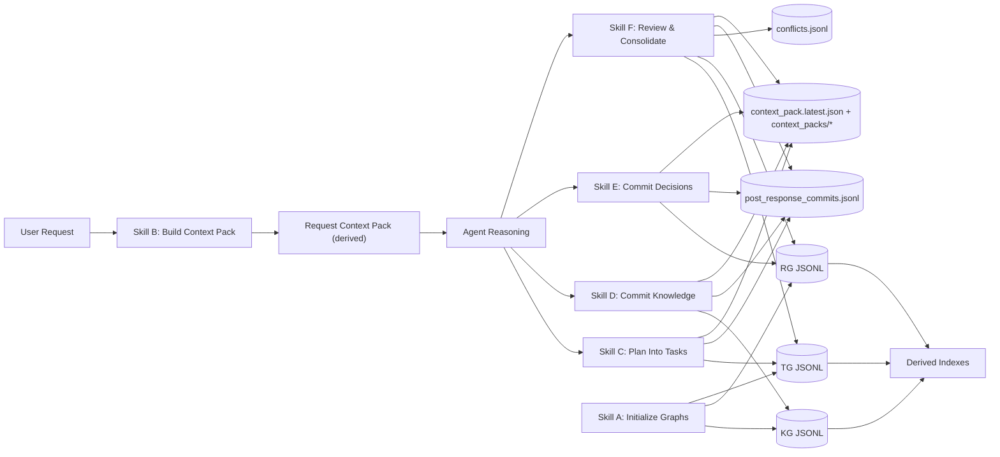

### 2.1 Core property

Any write operation that mutates KG/RG/TG must be traceable through commit and context synchronization (context-first, commit-row-last).

---

### 3. Formal Model

### 3.1 Layered state

Let:

- \(L = \{KG, RG, TG\}\)
- each layer \(l\) has append-only log \(\mathcal{E}_l\) (JSONL rows)
- each row is a node revision event \(e = (id, rev, payload, t_{created}, t_{updated})\)

Authoritative state is the logs \(\mathcal{E}_l\), not indexes.

### 3.2 Latest resolver

For node id \(x\), define candidate set \(C_x\subset \mathcal{E}_l\).

Resolver \(R(C_x)\):

1. If all candidates have valid integer `rev`:\
   choose max by `(rev, updated_at, line_order)`.
2. If any candidate misses valid `rev`:\
   choose max by `(updated_at, line_order)`.

This yields deterministic latest view \(V_l = \{R(C_x)\,|\,x\in IDs_l\}\).

### 3.3 Derived indexes

Index for layer \(l\):

\[
I_l = f(V_l)
\]

with minimal row fields:

- `id, title, tags, updated_at, type, layer, status, content_hash, full_hash`.

`content_hash` excludes volatile fields (`updated_at`, and for TG also `log`).

### 3.4 Identity policy

- KG: `KG-<TYPE>-<ULID>`
- RG: `RG-DEC-<ULID>`
- TG: `TG-TASK-<ULID>`

IDs are immutable; updates append new `rev` for existing `id`.

---

### 4. Data Contracts by Layer

### 4.1 KG: Knowledge layer

Semantic units:

- `entity`, `fact`, `definition`, `constraint`, `source`, `assumption`, `risk`.

Key rules:

- evidence-first knowledge;
- explicit uncertainty (`assumption`);
- stable `knowledge_key` for upsert;
- source provenance via `KG-SOURCE` upsert by `source_key`.

### KG upsert logic

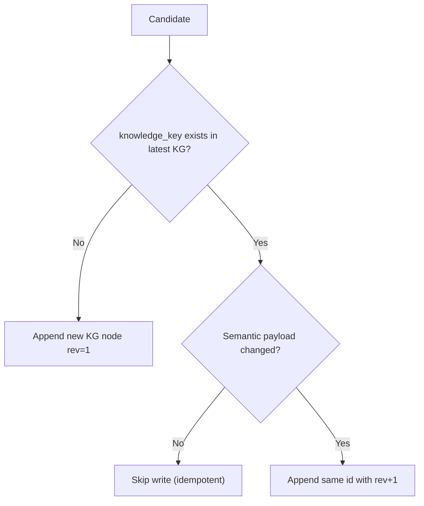

### Source upsert logic

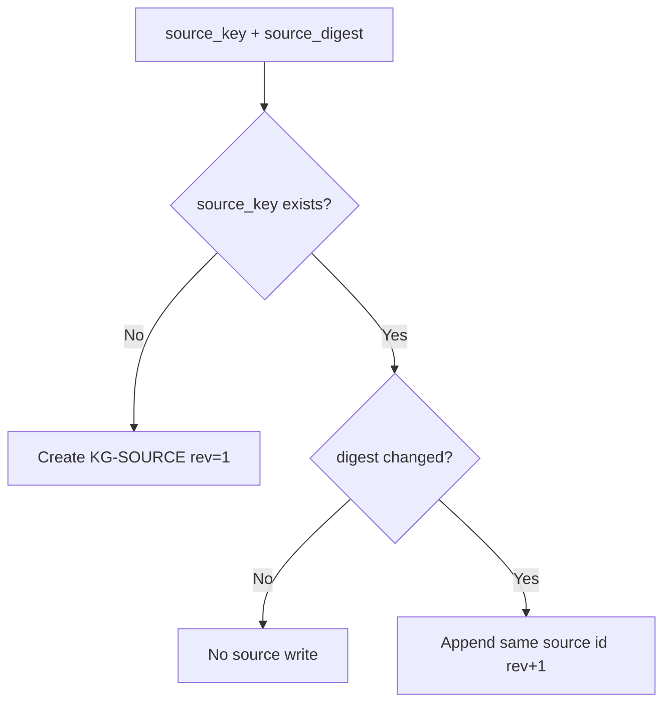

---

### 4.2 RG: Decision layer

Semantic unit: decision record with alternatives and selected option.

Mandatory decision identity:

- `decision_key = decision::<scope>::<normalized_title>`

Idempotency anchor:

- `decision_payload_hash` over canonical semantic subset:
  - context, decision statement, selected option,
  - normalized alternatives,
  - normalized rationale,
  - normalized refs,
  - `outcome.status`.

### RG lifecycle

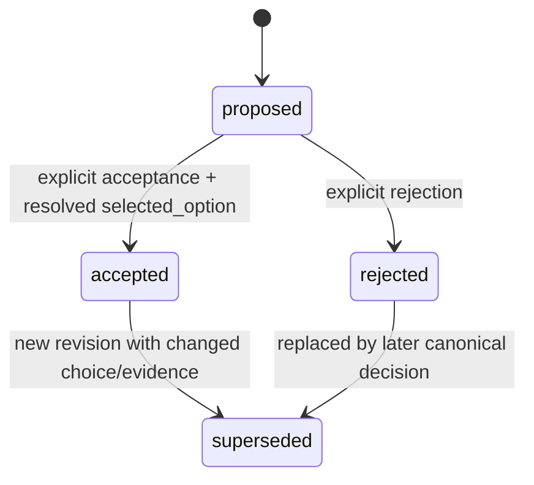

### Alternative identity discipline

- parsed alternatives preserve original parse order;
- unordered JSON object input is materialized and sorted deterministically by `(normalized_title, original_title)`;
- internal identity stored as stable `OPT-1..N`.

---

### 4.3 TG: Execution layer

Semantic unit: task with dependencies, blockers, measurable DoD, status lifecycle.

Task status model (canonical):

- `backlog, ready, in_progress, blocked, review, done, completed, cancelled, superseded, archived`
- spelling normalization: `canceled -> cancelled`.

### TG lifecycle

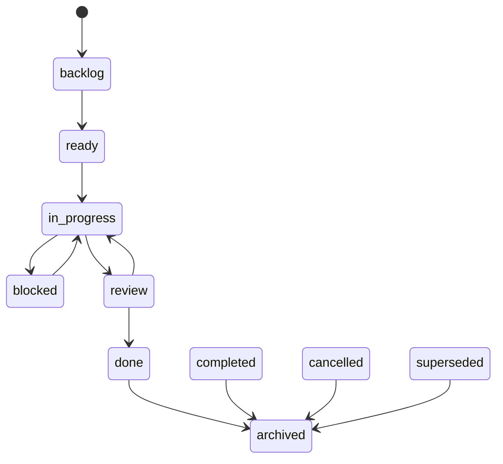

---

### 5. Commit and Synchronization Protocol

### 5.1 Critical ordering invariant

For apply operations with real mutations:

1. append node rows (KG/RG/TG/conflicts as relevant),
2. rebuild/verify indexes,
3. write context history artifact,
4. validate written context JSON,
5. atomically replace `context_pack.latest.json`,
6. append `post_response_commits.jsonl` row last.

No rollback is attempted for commit-row append failure after context replacement; recovery is explicit re-run/backfill.

### Sequence diagram

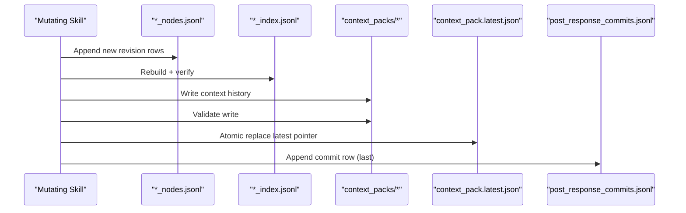

---

### 6. Runtime Retrieval Model (Skill B)

### 6.1 Request-time derived memory

A request context pack is not authoritative storage. It is a bounded derived view containing:

- intent,
- entity matches,
- task snapshot,
- knowledge snapshot,
- decision snapshot,
- recent deltas,
- optional clarify suggestion.

### Retrieval pipeline

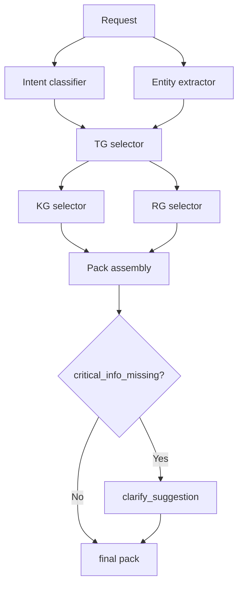

### 6.2 Deterministic scoring

\[
score = 5\cdot \mathbb{1}_{entity\_match}
+ 4\cdot \mathbb{1}_{ref\_by\_selected\_TG}
+ 3\cdot \mathbb{1}_{ref\_by\_accepted\_RG}
+ 2\cdot \mathbb{1}_{constraint\_or\_risk}
+ recency\_boost
\]

where:

- recency \(=2\) if updated ≤ 1 day,
- recency \(=1\) if updated ≤ 7 days,
- recency \(=0\) otherwise.

Tie-break:

1. score desc,
2. updated_at desc,
3. id asc.

### 6.3 Delta anchor priority

1. explicit `--commit-id`;
2. latest post-response commit;
3. prior `request_seq` fallback.

---

### 7. Planning as Task Synthesis (Skill C)

Skill C maps intent + linked graph context into execution-ready TG plan with deterministic ordering and DoD quality checks.

### Deterministic ordering in plan

1. phase order (`setup -> implement -> verify -> docs -> deploy`),
2. priority order,
3. title,
4. temp_id.

### Dependency correctness

- suggestion phase uses `TEMP-*` dependencies;
- graph must be DAG;
- no self-dependency;
- apply maps `TEMP-*` to real `TG-TASK-*` ids.

### Apply idempotency

`origin_plan_id` is used as idempotency key. Duplicate apply is blocked unless explicit force.

---

### 8. Knowledge Committer (Skill D)

Skill D converts raw conversation into durable KG revisions with provenance.

### 8.1 Dual hash provenance

- `source_request_hash_raw`: forensic fidelity (preserve case/punctuation, normalized newlines, trim).
- `source_request_hash_norm`: dedupe-oriented normalization.

`source_digest` uses raw hash.

### 8.2 Evidence granularity

Each candidate carries:

- `source_id`,
- confidence,
- `span` (line/char interval),
- short excerpt (<=200 chars).

### Conflict detection graph

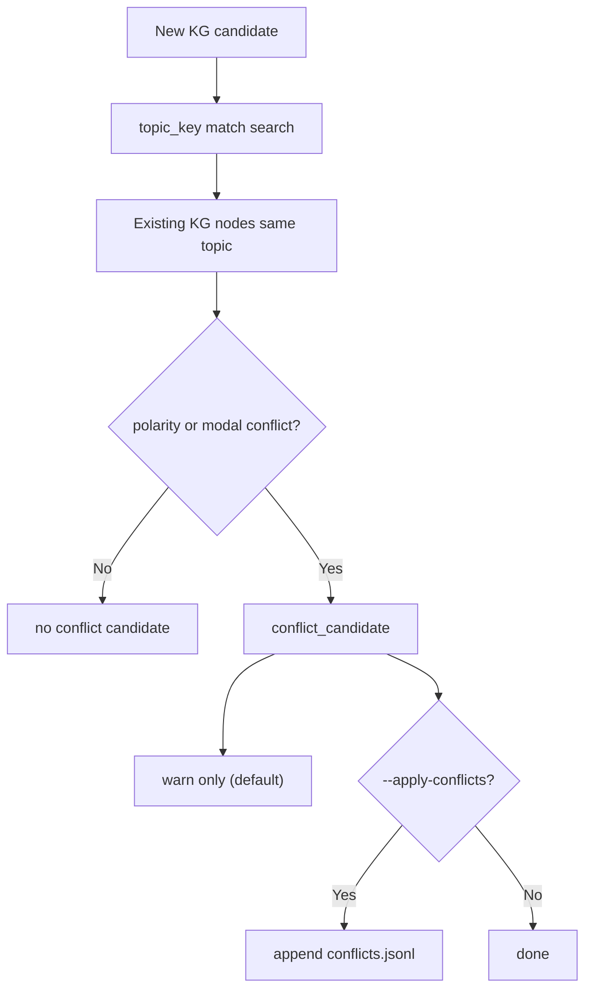

---

### 9. Decision Committer (Skill E)

Skill E persists choice-making events into RG.

### Decision apply flow

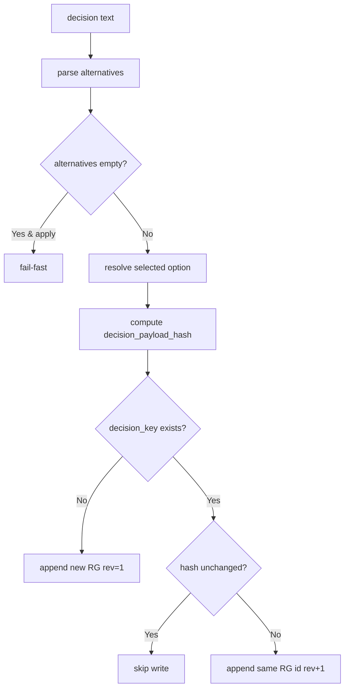

### Strictness boundary

- Suggest mode allows incomplete references but emits link suggestions.
- Apply mode can enforce both KG and TG refs (`--require-kg-tg true`).

---

### 10. Lifecycle Consolidation (Skill F)

Skill F performs periodic cleanup and consistency-preserving lifecycle actions.

Actions:

- archive stale terminal tasks,
- supersede non-canonical duplicate decisions by exact `decision_key`,
- resolve eligible conflicts (task- and evidence-gated).

### Replay-safe archive exclusions

Archive is blocked if TG task is referenced by:

- active TG deps/blocks,
- unresolved conflicts,
- latest resolved view of any RG decision `refs.tg_refs` (regardless of decision outcome).

### Consolidation flow

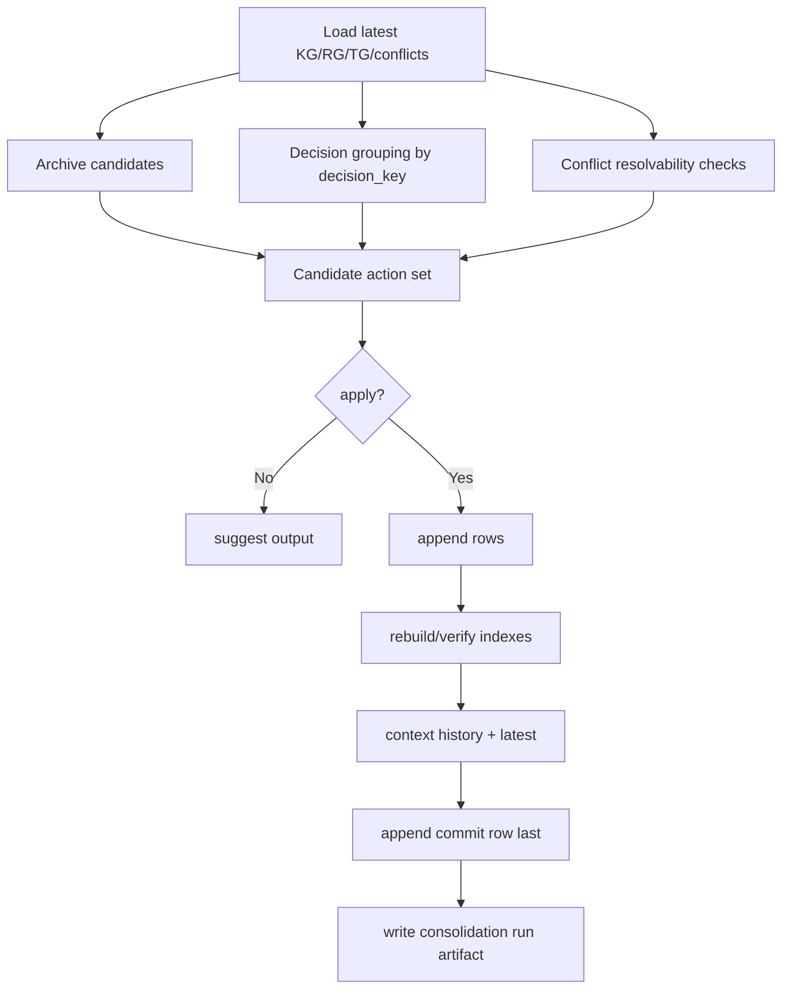

---

### 11. End-to-End Skill Orchestration

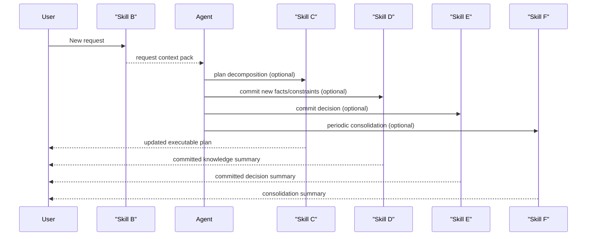

---

### 12. Determinism and Reproducibility Guarantees

### 12.1 Determinism mechanisms

- canonical JSON hashing;
- explicit tie-break chains in all ranking/resolver paths;
- stable IDs (ULID + layer/type prefix);
- monotonic sequence allocators (`request_seq`, `plan_seq`, `decision_seq`, etc.) with collision retry;
- append-only history (no in-place mutation of prior rows).

### 12.2 Reproducible replay

Given the same JSONL logs and deterministic skill versions, latest views and derived indexes are replayable.

---

### 13. Complexity Analysis (practical)

Let:

- \(N_{KG}, N_{RG}, N_{TG}\) be row counts in logs,
- \(U_l\) be unique IDs in layer \(l\).

Approximate complexities:

- latest view build: \(O(N_l)\) per layer,
- index rebuild: \(O(N_{KG}+N_{RG}+N_{TG})\),
- request retrieval: bounded ranking on latest sets with hard caps for output,
- apply commits: append + full/partial index rebuild + context/commit append.

3LG trades some write cost for strong correctness and replay guarantees.

---

### 14. Failure Modes and Recovery

### 14.1 Typical failures

- index drift;
- stale `context_pack.latest.json` relative to latest commit;
- malformed links;
- unresolved conflicts missing closure tasks;
- duplicate apply attempts.

### 14.2 Recovery strategy

- `repair` mode restores missing structure and rebuilds indexes;
- validators detect stale context/commit mismatches;
- idempotent upserts avoid duplicate semantic writes;
- explicit backfill for legacy rows missing key fields (e.g., `decision_key`).

### Recovery decision tree

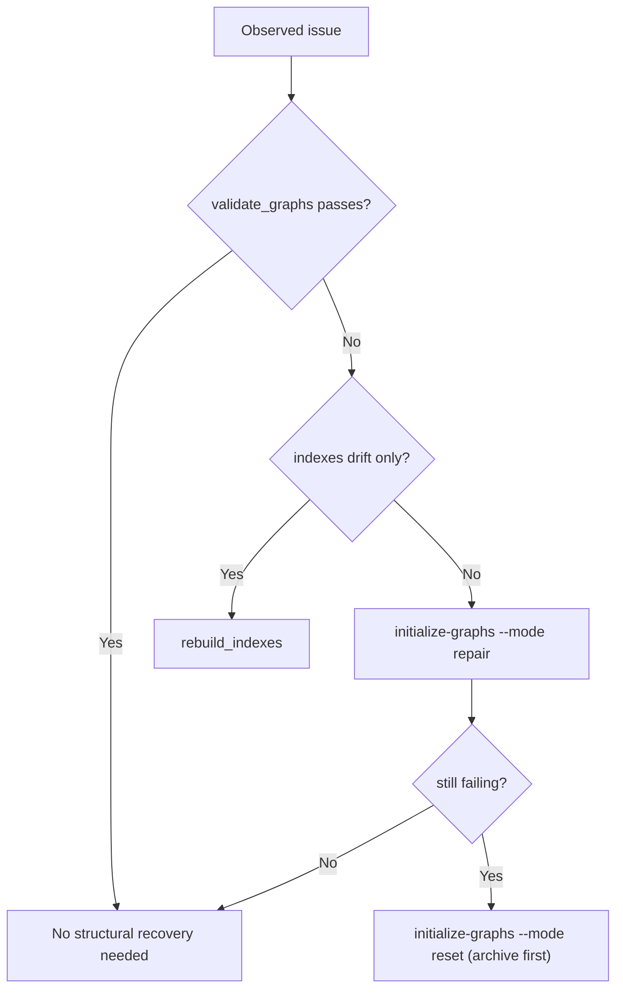

---

### 15. Security, Trust, and Governance Considerations

### 15.1 Trust boundaries

- Chat text is untrusted raw input.
- Commit skills are policy-enforcing translators into graph truth.
- Validators enforce structural and temporal invariants.

### 15.2 Governance benefits

- explicit rationale provenance;
- measurable task closure;
- auditable conflict handling;
- change traceability via commit rows.

---

### 16. Scientific Evaluation Blueprint

### 16.1 Research questions

- **RQ1:** Does 3LG improve factual consistency over transcript-only memory?
- **RQ2:** Does 3LG reduce token cost for long-horizon tasks?
- **RQ3:** Does 3LG improve decision traceability and reproducibility?
- **RQ4:** Does deterministic retrieval reduce behavioral variance across runs?

### 16.2 Baselines

- B0: transcript-only agent;
- B1: transcript + vector store (no structured RG/TG);
- B2: KG-only memory (no explicit RG/TG);
- B3: full 3LG.

### 16.3 Metrics

### Memory quality

- precision/recall of retrieved relevant nodes,
- contradiction rate per 100 interactions,
- stale-context rate (`latest context commit_id != latest post commit_id`).

### Control quality

- task completion rate with valid DoD,
- dependency integrity violations,
- unresolved conflict backlog size.

### Cost and latency

- average tokens per request,
- p95 response latency,
- incremental update cost.

### Reproducibility

- replay agreement score (same inputs => same selected nodes/order),
- hash stability across rebuilds.

### 16.4 Experimental protocol

1. Construct long-horizon benchmark scenarios (50-500 interactions each).
2. Use fixed random seeds and frozen model versions.
3. Capture full artifacts: logs, context packs, commit rows, indexes.
4. Run paired comparisons B0-B3.
5. Report significance and effect sizes.

### 16.5 Threats to validity

- domain-specific prompt effects,
- model version drift,
- annotation subjectivity for "relevant retrieval",
- operational variance from external tools.

Mitigation:

- frozen test harness,
- deterministic tie-break policies,
- public artifact release.

---

### 17. Suggested Paper Structure (IMRaD-Compatible)

1. **Introduction**: long-horizon LLM memory/control problem.
2. **Related Work**: RAG, memory graphs, decision intelligence, workflow agents.
3. **Method**: 3LG formalism + invariants + skill pipeline.
4. **Implementation**: append-only JSONL, resolver/hash/index mechanics.
5. **Experiments**: setup, baselines, metrics.
6. **Results**: quality/cost/reproducibility outcomes.
7. **Ablations**: remove RG, remove TG, remove commit ordering invariant.
8. **Discussion**: trade-offs, limitations, deployment guidance.
9. **Conclusion**: when 3LG is justified and future work.

---

### 18. Diagram Pack (for manuscript figures)

### Figure A: Layer interaction graph

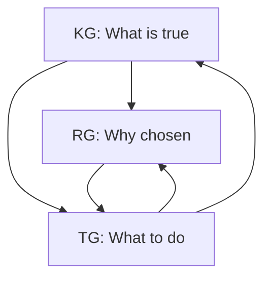

### Figure B: Data lineage from request to commit

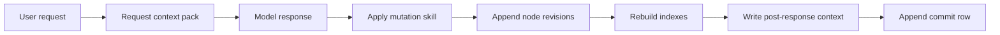

### Figure C: Latest resolver logic

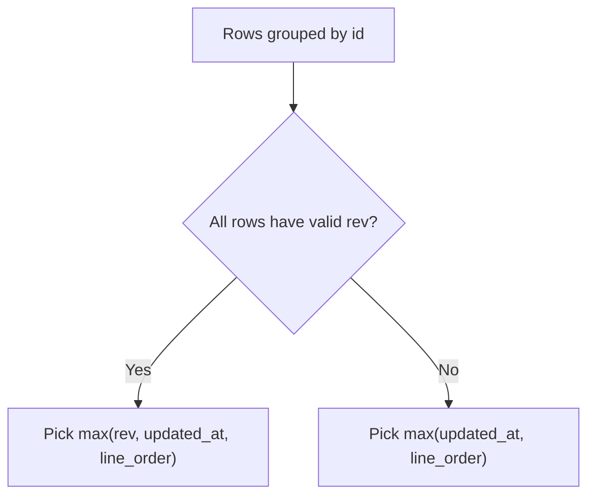

### Figure D: Conflict closure gate

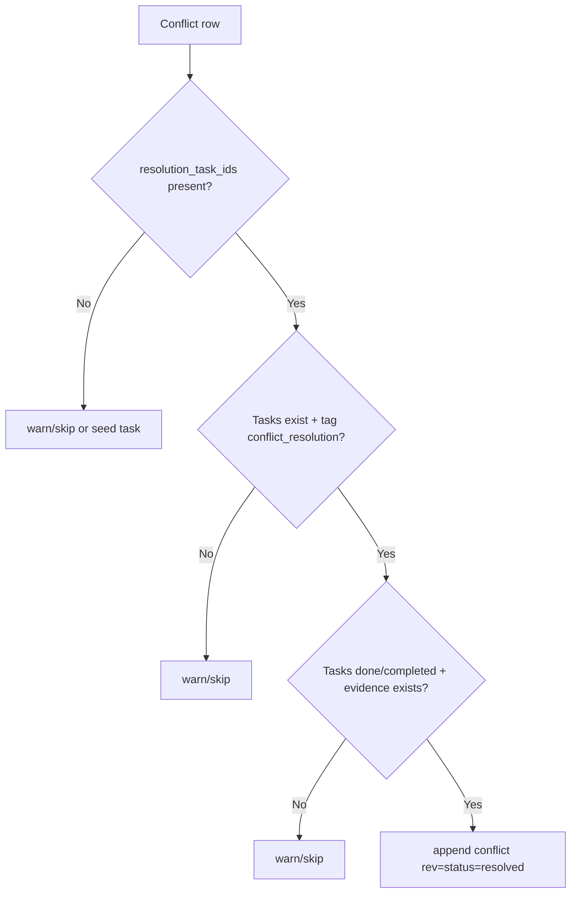

### Figure E: Replay-safe archiving guard

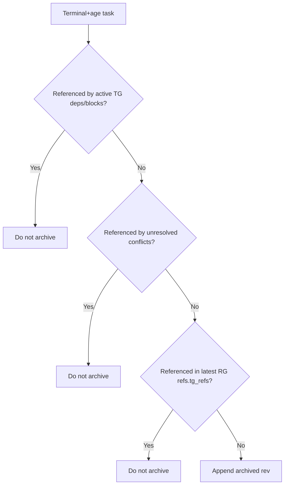

---

### 19. Operational Command Appendix

Note: commands below use repository-local scripts. Set `PROJECT_ROOT` to your cloned repo path.

### Initialize / repair / reset

```bash
python3 "$PROJECT_ROOT/skills/initialize-graphs/scripts/init_graphs.py" --project-root "$PROJECT_ROOT" --mode init
python3 "$PROJECT_ROOT/skills/initialize-graphs/scripts/init_graphs.py" --project-root "$PROJECT_ROOT" --mode repair
python3 "$PROJECT_ROOT/skills/initialize-graphs/scripts/init_graphs.py" --project-root "$PROJECT_ROOT" --mode reset
```

### Build request context

```bash
python3 "$PROJECT_ROOT/skills/build-context-pack/scripts/build_context_pack.py" --project-root "$PROJECT_ROOT" --request-text "<request>"
```

### Plan tasks

```bash
python3 "$PROJECT_ROOT/skills/plan-into-tasks/scripts/plan_into_tasks.py" --project-root "$PROJECT_ROOT" --request-text "<request>"
```

### Commit knowledge

```bash
python3 "$PROJECT_ROOT/skills/commit-knowledge/scripts/commit_knowledge.py" --project-root "$PROJECT_ROOT" --conversation-text "<conversation>"
```

### Commit decision

```bash
python3 "$PROJECT_ROOT/skills/commit-decisions/scripts/commit_decisions.py" --project-root "$PROJECT_ROOT" --decision-text "<alternatives + selected>"
```

### Review and consolidate

```bash
python3 "$PROJECT_ROOT/skills/review-and-consolidate/scripts/review_consolidate.py" --project-root "$PROJECT_ROOT" --apply true
```

### Validate invariants

```bash
python3 "$PROJECT_ROOT/skills/initialize-graphs/scripts/validate_graphs.py" --project-root "$PROJECT_ROOT"
```

---

### 20. Practical Notes for Writing the Actual Paper

- Position 3LG as a **memory + control** architecture, not only memory.
- Emphasize that RG and TG encode executive traceability absent in pure RAG.
- Report both quality and operational metrics (cost, replayability, incident recovery).
- Include failure analysis and explicit invariants: this is a major scientific strength.

---

### 21. One-Page Core Claim (for paper intro)

3LG proposes that reliable long-horizon LLM operation requires a typed external state machine rather than transcript accumulation. By decomposing state into knowledge truth (KG), decision rationale (RG), and executable control (TG), and by enforcing append-only revisions with deterministic retrieval and commit synchronization invariants, the system delivers reproducible and auditable agent behavior under real project evolution.

---

### 22. References to Project Artifacts

- Base operating manual (SSOT): `docs/3-layer_graph.md`
- Skills:
  - `skills/initialize-graphs/SKILL.md`
  - `skills/build-context-pack/SKILL.md`
  - `skills/plan-into-tasks/SKILL.md`
  - `skills/commit-knowledge/SKILL.md`
  - `skills/commit-decisions/SKILL.md`
  - `skills/review-and-consolidate/SKILL.md`
